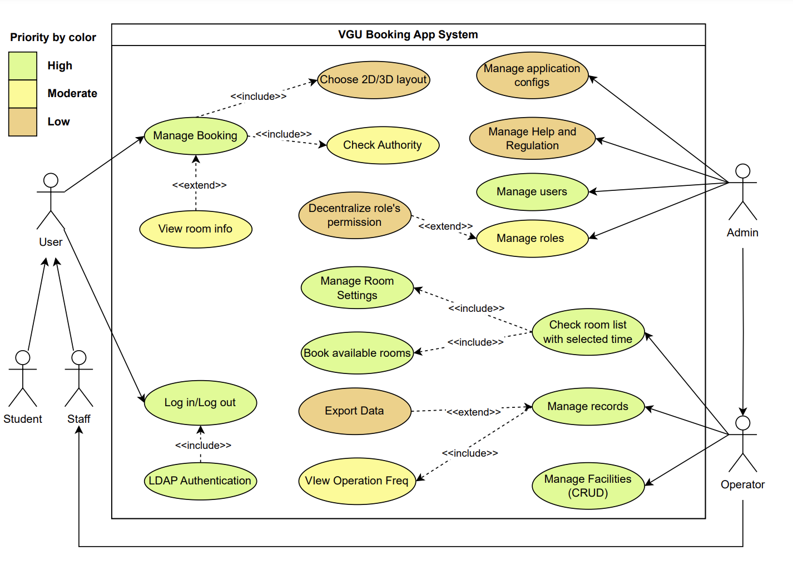

# VGU BOOKING APP

## Members
+ Quynh Ban Huu
+ Hai Cao Xuan
+ Toan Phi Dinh Van

## Project: Booking Application for Educational Institution

The university booking management application is poised to revolutionize the way staff and students interact with scheduling resources within the campus ecosystem. With a user-friendly interface designed for seamless navigation, the application offers differentiated access levels, empowering staff with administrative privileges while providing students with streamlined booking capabilities. Featuring a comprehensive booking calendar displaying availability across various facilities, users can effortlessly search, select, and reserve slots tailored to their needs. Customizable booking forms enable staff to gather specific details pertinent to each facility, while an automated approval workflow ensures prompt processing and transparent communication throughout the booking process. Resource management functionalities allow for efficient allocation and maintenance of equipment and spaces, enhancing overall utilization. Integration with the academic calendar mitigates conflicts with scheduled events, and usage analytics provide valuable insights for informed decision-making. Mobile compatibility extends accessibility, while localization support caters to diverse user demographics. Together, these features culminate in an innovative solution that optimizes booking procedures, fosters resource efficiency, and elevates the user experience for all stakeholders within the university community.

## Introduction

 ### Objective

The objective of this project is to develop an intuitive and efficient application for managing bookings within a university setting, serving both staff and students. By providing a user-friendly interface, customizable booking forms, and automated approval workflows, the application aims to streamline the process of reserving facilities such as lecture halls, seminar rooms, laboratories, and sports facilities. Integration with the academic calendar and robust resource management functionalities ensure optimal utilization of resources while minimizing conflicts and downtime. Additionally, the application seeks to enhance accessibility through mobile compatibility and localization support, ultimately improving the overall experience for users and promoting efficient utilization of university resources. ..

 ### Audience

The target audience for the university booking management application comprises university staff overseeing facility bookings, resource scheduling, and administrative tasks, along with students organizing academic or extracurricular events. Additionally, administrators seeking to optimize resource allocation and operational efficiency are secondary targets. The application aims to streamline booking processes and enhance resource utilization for staff, students, and administrators alike.

 ### Project Scope

The project scope includes developing a user-friendly application for managing bookings within a university environment. This involves creating features such as a booking calendar, customizable forms, automated approval workflows, and resource management functionalities. The application will integrate with the university's academic calendar, provide usage analytics, and support mobile accessibility and localization. The scope encompasses catering to the needs of both staff and students, with the overarching goal of optimizing resource utilization and enhancing the overall booking experience within the university community.

1. *Log in* and *authentication* for **Admin** and **Staff**.

2. *Create*, *Update* and *Delete* a new account (only for **Admin**).

3. *Accept*, *Decline* a new booking request (only for **Admin**).

4. *Manage*, and *Decentralize* permissions and actions of user's role (only for **Admin**).

5. **Create Booking**.

6. *Create*, *Read*, *Update*, *Delete*  the **Room Information** and **Facility Information**

7. *Export* records and *View* operation frequency (of **Bookings**, **Facilities**, and more...)

8. *Notify* **User** about *status* of **Booking**.

9. *Interactive map* of **VGU Campus** with *2D* or *3D* views.

 ### Constraints
Developing a booking system application for an educational institution entail navigating various challenges. Seamless integration with existing systems, encompassing databases and calendars, demands meticulous planning and coordination to prevent compatibility issues. Meeting the diverse needs of students, faculty, and administrative staff requires careful customization. Designing the system to scale effectively to accommodate potential growth is crucial for optimal performance. Crafting an intuitive user interface that strikes a balance between simplicity and functionality poses a design challenge, and resource allocation and optimization demand sophisticated algorithms. Balancing technical constraints and budget limitations while meeting user expectations is a constant challenge. 

Addressing these challenges through careful planning, stakeholder engagement, and adaptability is imperative for the successful implementation of a booking system in an educational institution, contributing to a streamlined and user-friendly experience for all stakeholders.

## Product Backlog (Not yet Updated)
Use Type: E-Employee, A-Admin, S-System;

Categorized: F-Functional, N-Nonfunctional.
|No|Initial Requirement|Extended Requirement| Description | Priority | Sprint | Use type | Functioning|Business Value|
|--|-------------|-------------|-----------|-------------|---------|---------|------|--------------------------------|
|1|User Creation and Management|- Add account - Sign in/Sign out - Edit Profile - Management|- A new branch is formed and needs an account - Users can sign in or sign out of the system - User wants to modify the personal information - Managing employee’s account for Administrator| - High  - High - High - High|- 2 - 2 - 3 - 3 | - A - E,A - E,A - A | - F   - F - F - F |This is a private app, so having an account is essential for access and security. This makes account creation exclusively an Admin’s function.|
|2 |Storage for Medicine Management |- Data table for medicine and drugs - Data searching for the storage system - Checking for medicine’s status|- A table that includes the name, id, and the amount in stock for each drug. In the case of Admin, choose which branch they want to check out - An easily accessible table is without its search function - Check to see whether or not the product is out of stock, nearly out of stock, expired, or nearly expired|- High - Med  - Med|- 3 - 3 - 3 | - E,A  - E,A - S|- F - F - F |An important part of a management system. With an easy view of the amount of each product and its product, a good storage system can go a long way for a company.|
|3 |Importing and Exporting Medicine |- Exporting - Importing|- The employee makes a sale and updates it to the system and makes an invoice from it - Admin replenish out-of-stock and expired medicine in a certain branch|- High - High|- 4 - 4| - E - A|- F - F |A management system is without updating the amount on a whim and saves it to the system.|
|4 |Messaging System |- Direct messaging - Group messaging|- Communi- cate between employees or between employees and Admin - Create a group chat that includes both employees and Admin|- High - Med|- 4 - 4| - E,A - E,A|- F - F |Communication is key to a successful company, MediMe provides this to breach the gap between users.|
|5 |Generating Report |- Daily report - Monthly report|- Generate a report for the day for an employee to keep track of their progress - Unlike a daily report, this report is exclusive for Admin and is generated at the end of every month|- High - High|- 4 - 4| - S - S|- F - F |For any business venture, keeping track of profit and spending is crucial. To do this, a report is generally the way to go.|
|6 |Notification |Notification|Notify about medicine’s status|Low||S|N |For future development.|
## Project Overview
### Overall Architecture
MediMe project is created under one of the state-of-the-art approaches for a web application, the Model-View-Controller. Database access is established via many layers of service. For this approach, the user can easily communicate with the server or database through a controller.

### Use case diagram

This web application was deployed as a public system to manage the booking activities in Vietnamese-German University.

### ER Diagram

### Activity Diagrams

### State Diagrams

### Collaboration Diagrams

## Software

### User Interface Design
<!-- 
  
 -->

https://www.figma.com/file/tsN54p47T8cXX8tXgb0GCA/VBA-UI-Sketch?type=design&node-id=0%3A1&mode=design&t=G6sYQgA9mIetAjBr-1

The user interface design for the university booking management application will prioritize simplicity, intuitiveness, and accessibility. Users will find a clean layout with clear navigation paths and intuitive icons. The booking calendar will be central, allowing users to browse available slots easily. Customizable booking forms will enable tailored requests, and an automated approval workflow will keep users informed. Resource management features will be integrated, and the interface will be responsive across devices with accessibility features for inclusivity.

### Frontend Technologies

### Backend Technologies

### Database (NOT UPDATED)

### Login and Create a new account
#### Login

#### LDAP Authentication

### Create Booking

### Booking management

#### From the employee's point of view

#### From the Admin's point of view

### Admin Management

#### User Management

#### Booking Request Approval

#### Application Config Management

#### Facility Management

#### Room Management

#### Role Management and Decentralization

### Records management

#### View Operations Frequency

#### Export Booking and Facility Information

### Handle Notifications

### Interactive Map

### Help and Regulations management

